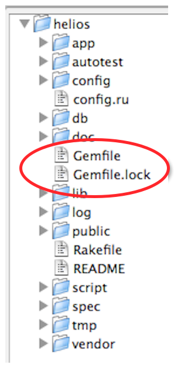

!SLIDE center

!SLIDE center

!SLIDE commandline incremental
# Why Bundler?

    $ gem install thin
    Successfully installed rack-1.1.0
    ...
    4 gems installed

    $ gem install rails
    Successfully installed rack-1.0.1
    ...
    7 gems installed

    $ irb
    >> require "thin"
    => true
    >> require "actionpack"
    Gem::LoadError: can't activate rack (~> 1.0.0, runtime)
    for ["actionpack-2.3.5"], already activated rack-1.1.0
    for ["thin-1.2.7"]

!SLIDE
# Gemfile

    @@@ruby
    # Gemfile
    source "http://rubygems.org"
    gem "nokogiri"
    gem "rack", "1.1.0"

!SLIDE commandline
# bundle install

    $ bundle # short for bundle install
    Using rake (0.8.7)
    Using abstract (1.0.0)
    Using activesupport (3.0.3)
    Using builder (2.1.2)
    Using i18n (0.4.2)
    Using activemodel (3.0.3)
    Using erubis (2.6.6)
    Using rack (1.2.1)
    Using rack-mount (0.6.13)
    Using rack-test (0.5.6)
    Using tzinfo (0.3.23)
    ...

!SLIDE commandline
# Add Gemfiles to git

    $ git add Gemfile Gemfile.lock
    $ git commit -m "Added Gemfile and lock"
    [master ff48b07] Added Gemfile and lock
    2 files changed, 1 insertions(+), 1 deletions(-)

!SLIDE
# Gemfile.lock

    @@@python
    GEM
      remote: http://rubygems.org/
      specs:
        abstract (1.0.0)
        actionmailer (3.0.3)
          actionpack (= 3.0.3)
          mail (~> 2.2.9)
        actionpack (3.0.3)
          activemodel (= 3.0.3)
          activesupport (= 3.0.3)
          ...

!SLIDE
# Groups

    @@@ruby
    # These gems are in the :default group
    gem "nokogiri"
    gem "sinatra"

    group :development do
      gem "wirble"
    end

    group :test do
      gem "rspec"
      gem "faker"
    end

!SLIDE commandline
# bundle install --without test

    $ bundle install --without test
    Using rake (0.8.7)
    Using abstract (1.0.0)
    Using activesupport (3.0.3)
    Using builder (2.1.2)
    Using i18n (0.4.2)
    Using activemodel (3.0.3)
    Using erubis (2.6.6)
    Using rack (1.2.1)

!SLIDE
# Git source

    @@@ruby
    gem "factory_girl_rails",
      :git => "http://github.com/msgehard/factory_girl_rails.git"
    gem "factory_girl"

!SLIDE commandline incremental
# Other commands

    $ bundle show haml-rails
    /Users/andersjanmyr/.rvm/gems/ruby-1.9.2-p0/gems/haml-rails-0.3.4
    $ bundle open haml
    # Opens haml gem in editor
    $ bundle check
    The Gemfile's dependencies are satisfied
    $ bundle viz
    # Creates a graph of the dependencies

!SLIDE
# Bundler Without Rails

    @@@ruby
    require "rubygems"
    require "bundler/setup"

    Bundler.require(:default)

#
