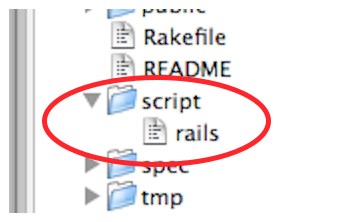

!SLIDE center
# Script rails

!SLIDE commandline
# Rails script

    $ rails
    Usage:
      rails new APP_PATH [options]

    Options:
      -d, [--database=DATABASE]   # Preconfigure for selected database (options: mysql/oracle/postgresql/sqlite3/frontbase/ibm_db)
                                  # Default: sqlite3
      -m, [--template=TEMPLATE]   # Path to an application template (can be a filesystem path or URL)
      -O, [--skip-active-record]  # Skip Active Record files
      -T, [--skip-test-unit]      # Skip Test::Unit files
      -J, [--skip-prototype]      # Skip Prototype files

    Description:
        The 'rails new' command creates a new Rails application with a default
        directory structure and configuration at the path you specify.

    Example:
        rails new ~/Code/Ruby/weblog

        This generates a skeletal Rails installation in ~/Code/Ruby/weblog.
        See the README in the newly created application to get going.

!SLIDE commandline
# rails new

    $ rails new
    create
    create  README
    create  Rakefile
    create  config.ru
    create  .gitignore
    create  Gemfile
    create  app
    create  app/controllers/application_controller.rb
    create  app/helpers/application_helper.rb
    create  app/mailers
    create  app/models
    create  app/views/layouts/application.html.erb
    create  config
    create  config/routes.rb
    ...

!SLIDE commandline
# rails new -m
## Use an application template

    $ rails new new-app -m https://github.com/andersjanmyr/jayway-templates/raw/master/lib/templates/rails_template.rb
           apply  /Users/andersjanmyr/Projects/jayway-templates/lib/templates/rails_template.rb
         gemfile    ruby-debug19
          remove    test
         gemfile    rspec
         gemfile    http://github.com/msgehard/factory_girl_rails.git
         gemfile    haml
         gemfile    simple_form
         gemfile    responders
         gemfile    devise (>= 1.1.rc2)
          remove    app/views/layouts/application.html.erb
          create    app/views/layouts/application.html.haml
     initializer    jquery.rb
          remove    public/javascripts/controls.js
          create    public/javascripts/jquery.js
          create    public/javascripts/rails.js
             run    gem install bundler from "."
    Successfully installed bundler-1.0.7
    1 gem installed
             run    bundle install from "."
    Updating http://github.com/msgehard/factory_girl_rails.git
        ...

!SLIDE code
# Application Template

    @@@ruby
    #Development
    gem "ruby-debug19", :group => :development

    # Replace test framework
    remove_dir 'test'
    gem 'rspec', :group => :test

    remove_file 'app/views/layouts/application.html.erb'
    file 'app/views/layouts/application.html.haml' , <<-HAML
        ...
    HAML
    ...
    get 'https://github.com/rails/jquery-ujs/raw/master/src/rails.js', 'public/javascripts/rails.js'
    ...
    run "gem install bundler"
    run 'touch db/.gitkeep lib/tasks/.gitkeep'

!SLIDE commandline
# rails (in application dir)

    $ rails
    Usage: rails COMMAND [ARGS]

    The most common rails commands are:
     generate    Generate new code (short-cut alias: "g")
     console     Start the Rails console (short-cut alias: "c")
     server      Start the Rails server (short-cut alias: "s")
     dbconsole   Start a console for the database specified in config/database.yml
                 (short-cut alias: "db")
     new         Create a new Rails application. "rails new my_app" creates a
                 new application called MyApp in "./my_app"

    In addition to those, there are:
     application  Generate the Rails application code
     destroy      Undo code generated with "generate"
     benchmarker  See how fast a piece of code runs
     profiler     Get profile information from a piece of code
     plugin       Install a plugin
     runner       Run a piece of code in the application environment

    All commands can be run with -h for more information.

!SLIDE commandline
# rails server

    $ rails server --help
    Usage: rails server [mongrel, thin, etc] [options]
        -p, --port=port                  Runs Rails on the specified port.
                                         Default: 3000
        -b, --binding=ip                 Binds Rails to the specified ip.
                                         Default: 0.0.0.0
        -c, --config=file                Use custom rackup configuration file
        -d, --daemon                     Make server run as a Daemon.
        -u, --debugger                   Enable ruby-debugging for the server.
        -e, --environment=name           Specifies the environment to run this server under (test/development/production).
                                         Default: development
        -P, --pid=pid                    Specifies the PID file.
                                         Default: tmp/pids/server.pid

        -h, --help                       Show this help message.

!SLIDE commandline
# rails server

    $ rails server
    => Booting WEBrick
    => Rails 3.0.3 application starting in development on http://0.0.0.0:3000
    => Call with -d to detach
    => Ctrl-C to shutdown server
    [2010-11-30 11:33:18] INFO  WEBrick 1.3.1
    [2010-11-30 11:33:18] INFO  ruby 1.9.2 (2010-08-18) [x86_64-darwin10.4.0]
    [2010-11-30 11:33:18] INFO  WEBrick::HTTPServer#start: pid=47358 port=3000

!SLIDE commandline
# rails dbconsole

    $ rails dbconsole
    rails dbconsole
    SQLite version 3.6.12
    Enter ".help" for instructions
    Enter SQL statements terminated with a ";"
    sqlite>

!SLIDE commandline
# rails generate

    $ rails g
    Usage: rails generate GENERATOR [args] [options]

    General options:
      -p, [--pretend]  # Run but do not make any changes

    Please choose a generator below.
    Rails:
      controller
      migration
      model
      observer
      resource
      responders_controller
      scaffold
      scaffold_controller

    ActiveRecord:
      active_record:devise

    ActsAsTaggableOn:
      acts_as_taggable_on:migration

    Devise:
      devise
      ...

!SLIDE commandline
# rails console

    $ rails c
    Welcome to RAILS. You are using ruby 1.9.2p0 (2010-08-18 revision 29036) [x86_64-darwin10.4.0]. Have fun ;)
    Loading development environment (Rails 3.0.3)
    >

