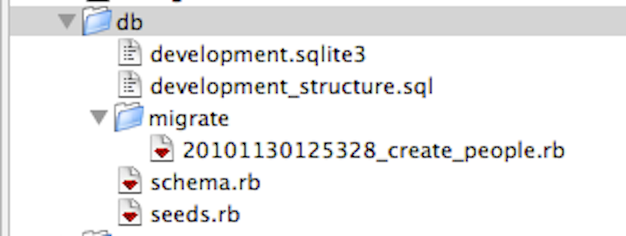

!SLIDE center
# Rails DB

!SLIDE commandline
# rails g model

    $ rails generate model Product name:string description:text
        invoke  active_record
        create    db/migrate/20101130142015_create_products.rb
        create    app/models/product.rb
        invoke    rspec
        create      spec/models/product_spec.rb
        invoke      factory_girl
        create        spec/factories/products.rb

!SLIDE code
# Migration

    @@@ruby
    # db/migrate/20101130142015_create_products.rb
    class CreateProducts < ActiveRecord::Migration
      def self.up
        create_table :products do |t|
          t.string :name
          t.text :description

          t.timestamps
        end
      end

      def self.down
        drop_table :products
      end
    end

!SLIDE commandline
# rails g migration

    $ rails g migration add_price_to_product price:decimal
        invoke  active_record
        create    db/migrate/20101130142449_add_price_to_product.rb

    # Works for add_xx_to_yy or AddXxToYy
    # And for remove_xx_from_yy or RemoveXxFromYy

!SLIDE code
# Alter migration

    @@@ruby
    # db/migrate/20101130142449_add_price_to_product.rb
    class AddPriceToProduct < ActiveRecord::Migration
      def self.up
        add_column :products, :price, :decimal
      end

      def self.down
        remove_column :products, :price
      end
    end

!SLIDE commandline
# rake db:tasks

    $ rake db:migrate
    ==  CreatePeople: migrating ===================================================
    -- create_table(:people)
       -> 0.0014s
    ==  CreatePeople: migrated (0.0016s) ==========================================

    $ rake db:rollback
    ==  CreatePeople: reverting ===================================================
    -- drop_table(:people)
       -> 0.0009s
    ==  CreatePeople: reverted (0.0010s) ==========================================

!SLIDE code
# db/schema.db

    @@@ruby
    ActiveRecord::Schema.define(:version => 20101130125328) do

      create_table "people", :force => true do |t|
        t.string   "firstname"
        t.string   "lastname"
        t.integer  "age"
        t.datetime "created_at"
        t.datetime "updated_at"
      end

    end

!SLIDE code
# $ rake db:structure:dump

    @@@sql
    /* db/development_structure.sql */
    CREATE TABLE "people" (
        "id" INTEGER PRIMARY KEY AUTOINCREMENT NOT NULL,
        "firstname" varchar(255),
        "lastname" varchar(255),
        "age" integer,
        "created_at" datetime,
        "updated_at" datetime);
    CREATE TABLE "schema_migrations" ("version" varchar(255) NOT NULL);
    CREATE UNIQUE INDEX "unique_schema_migrations"
        ON "schema_migrations" ("version");
    INSERT INTO schema_migrations (version)
        VALUES ('20101130125328');

!SLIDE code
# $ rake db:seed

    @@@ruby
    # db/seeds.rb
    Person.create!(:firstname => 'Anders',
        :lastname => 'Janmyr', :age => 41)
    Person.create!(:firstname => 'Kerstin',
        :lastname => 'Janmyr', :age => 81)

    # Seeds are required production data

