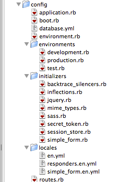

!SLIDE center

!SLIDE
# Application Start

    # environment.rb loads application.rb
    # application.rb loads boot.rb
        # boot.rb requires gems via bundler
    # application.rb configures environment
        # Generators
        # LoadPath
        # Localizations
        # Initializers
        # Environment specific initialization
        # Setup Routing

!SLIDE code
# Generators

    @@@ruby
    config.generators do |g|
      g.orm  :active_record
      g.scaffold_controller :responders_controller
      g.template_engine :haml
      g.test_framework :rspec, :fixture => true, :view_specs => false
      g.integration_tool :rspec
      g.fixture_replacement :factory_girl, :dir => 'spec/factories'
      g.stylesheets false
    end

!SLIDE bullets
# Initializers
## App specific configuration

    # backtrace_silencers.rb
    # inflections.rb
    # jquery.rb
    # mime_types.rb
    # sass.rb
    # secret_token.rb
    # session_store.rb
    # simple_form.rb

!SLIDE code
# database.yml

    @@@python
    development:
      adapter: sqlite3
      database: db/development.sqlite3
      pool: 5
      timeout: 5000

    test:
      ...

