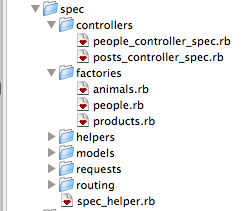

!SLIDE center
# RSpec

!SLIDE code
# Terminology

    @@@ruby
    rspec           == test_unit
    specification   == test_group
    example         == test
    expectation     == assertion

!SLIDE code
# A spec

    @@@ruby
    require 'spec_helper'

    describe Item do
      pending "Todo"
    end

!SLIDE code
# A spec with examples

    @@@ruby
    describe 'a guest user' do

        it 'should not see private items' do
            guest = User.find(:guest)
            guest.private_items.size.should == 0
        end

        it 'should see public items' do
            guest = User.find(:guest)
            guest.public_items.size.should == 4
        end

!SLIDE code
# before and matchers

    @@@ruby
    describe 'a guest user' do
        before do
            setup_items
            @guest = User.find(:guest)
        end

        it 'should not see private items' do
            @guest.private_items.should be_empty
        end

        it 'should see public items' do
            @guest.public_items.size.should == 4
            @guest.should have(4).public_items
        end
    end

!SLIDE code
# Error expectation

    @@@ruby
    lambda { this_block }.should raise_error

!SLIDE code
# Change expectation

    @@@ruby
    describe 'add ability to guest user' do
        it 'should change the role to user' do
            expect {
                User.ability << Read
            }.to change { User.role }.from(:guest).to(:reader)
        end

    end

!SLIDE code
# Matchers

==, <, <=, >, >=, ===, =~
be_true, be_false, be_nil
be_[predicate](*args)
be_close(expected, delta)
be_instance_of(klass)
be_kind_of(klass)
change(receiver, message, block)
eq(expected), eql(expected), equal(expected)
exist(arg=nil)
has_[predicate](expected)
have(number).collection_or_sugar
match(pattern)
match_array(array)
raise_error(named_error=nil, string_or_regexp=nil)
raise_exception(named_error=nil, string_or_regexp=nil)
respond_to(*names)
satisfy(&block)
