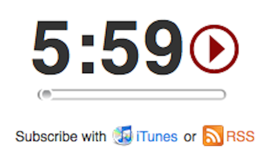
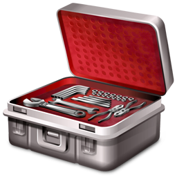
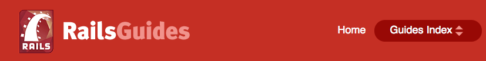
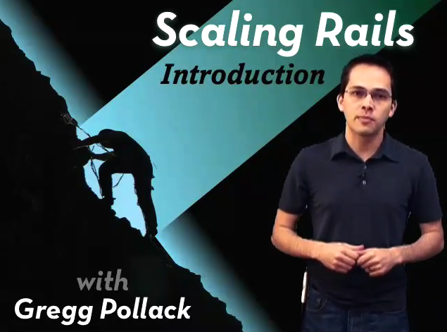
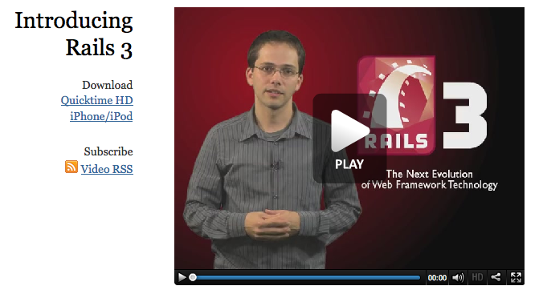

!SLIDE center
# Ruby 5
## http://ruby5.envylabs.com/

!SLIDE center
# Railscasts
## http://railscasts.com/

!SLIDE center
# Rails Podcast
## http://podcast.rubyonrails.org/

!SLIDE center
# RDoc Info
## http://rubydoc.info/

!SLIDE center
# Ruby Toolbox
## http://www.ruby-toolbox.com/

!SLIDE center
# Rails Guides
## http://guides.rubyonrails.org/

!SLIDE center
# Scaling Rails
## http://railslab.newrelic.com/scaling-rails

!SLIDE center
# Ruby on Rails Screencasts
## http://rubyonrails.org/screencasts

